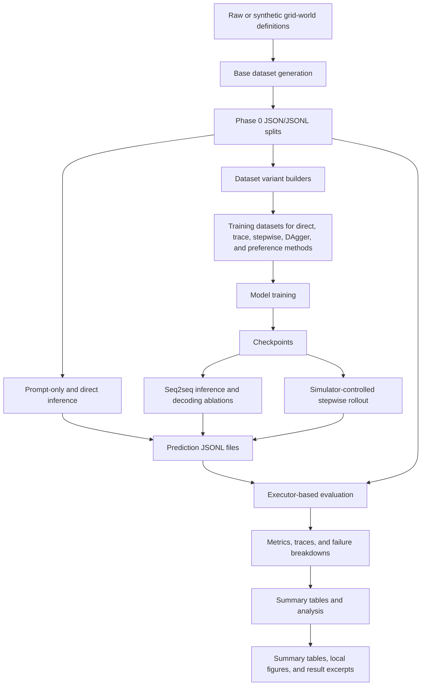
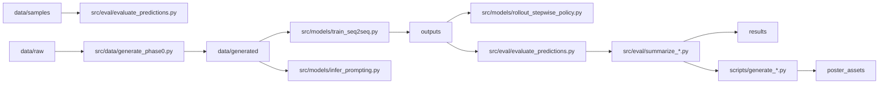

# Project Workflow

This document connects the code, data, and result artifacts into one end-to-end workflow. It is intended to be read as a detailed flowchart: each item states its role, inputs, and outputs.

## Format
This file uses Markdown plus Mermaid diagrams. Mermaid gives a visual pipeline on GitHub, while tables keep each code file and artifact easy to scan.

## End-to-End Pipeline

## Artifact Flow

## Primary Stages
| Stage | Core content | Inputs | Outputs |
| --- | --- | --- | --- |
| Problem definition | Defines single-goal grid path planning as action-sequence generation. | Grid size, start, goal, obstacles. | A question and a target action sequence. |
| Base data generation | Builds controlled ID and OOD grid-world splits. | Split specifications and random seed. | `data/generated/phase0` JSON/JSONL records. |
| Dataset conversion | Creates alternative supervision formats for ablations. | Phase 0 records and evaluated rollout traces. | Method-specific JSONL datasets under `data/generated`. |
| Model training | Fine-tunes seq2seq models for direct or one-step planning. | Training config JSON and JSONL datasets. | Checkpoints, train summaries, and validation metrics in `outputs`. |
| Inference | Produces model action strings by direct decoding, prompting, or rollout. | Checkpoints or API/local models plus evaluation datasets. | Prediction JSONL files. |
| Evaluation | Executes actions in the grid and assigns planning metrics. | Predictions and aligned dataset records. | Metrics JSON, evaluated traces, and failure breakdowns. |
| Analysis | Aggregates metrics by model, split, path length, and failure type. | Per-split metrics and evaluated predictions. | CSV/JSON summaries. |
| Reporting | Converts summaries into tables and optional local figures. | Summary tables, selected cases, and figure scripts. | Tracked result summaries plus ignored local presentation artifacts. |

## Data and Artifact Map
| Item | Core content | Inputs | Outputs |
| --- | --- | --- | --- |
| `data/raw/` | Stores upstream or local raw datasets that are not committed in full. | External PPNL-style data sources. | Local source records for optional regeneration. |
| `data/samples/path_planning_sample.jsonl` | Provides a minimal executable dataset for quick evaluation checks. | Hand-picked grid examples. | Three JSONL records with `world`, `start`, `goal`, and `target`. |
| `data/samples/sample_predictions.jsonl` | Provides matching toy predictions for the sample dataset. | Sample ids and action strings. | Evaluator-ready prediction rows. |
| `data/generated/phase0/` | Stores generated base train, validation, ID, and OOD splits. | `src/data/generate_phase0.py`. | Full Phase 0 JSON/JSONL datasets. |
| `data/generated/phase2_*` | Stores derived training datasets for SFT, stepwise, scaling, and preference experiments. | Phase 0 records and conversion scripts. | Method-specific JSONL train/eval splits. |
| `source_models/` | Stores local downloaded Hugging Face model repositories. | External model downloads. | Local model paths used by `model_registry.py`. |
| `outputs/` | Stores local experiment outputs and is mostly ignored by version control. | Training, inference, rollout, and evaluation commands. | Checkpoints, predictions, logs, metrics, and traces. |
| `results/` | Stores lightweight result summaries suitable for review. | Summarized metrics from `outputs`. | Compact CSV/JSON result excerpts. |
| `poster_assets/` | Stores locally generated visual assets for presentation and report use. | Figure-generation scripts and curated metrics. | Ignored PNG/SVG figures. |

## Source Code Map: `src/data`
| File | Core content | Inputs | Outputs |
| --- | --- | --- | --- |
| `analyze_residual_topk_failures.py` | Analyzes residual top-k rollout failures such as loops and obstacle-proximal oscillations. | Evaluated prediction JSONL files. | Failure summary JSON and detail JSONL. |
| `analyze_stepwise_failures.py` | Summarizes stepwise rollout failures by distance, path length, and loop patterns. | Evaluated stepwise prediction files. | Diagnostic JSON summaries. |
| `generate_dense_large_splits.py` | Generates compact dense large-grid held-out splits. | Grid sizes, obstacle counts, and seed. | JSON/JSONL large-grid test splits. |
| `generate_multiscale_sft.py` | Generates multi-scale SFT data for multiple grid sizes. | Phase 0 records and generation settings. | Multi-scale JSON/JSONL train and eval splits. |
| `generate_no_revisit_beam_data.py` | Generates data for no-revisit beam rollout experiments. | Grid-generation settings and seed. | JSON/JSONL no-revisit datasets. |
| `generate_phase0.py` | Generates the base grid path-planning datasets with shortest paths. | Dataset specs and random seed. | Phase 0 environments, manifests, and JSON/JSONL splits. |
| `generate_react_trace_size_generalization.py` | Generates compact ReAct-style trace data for size generalization. | Size-generalization grid specs. | Trace-formatted JSON/JSONL datasets. |
| `make_dagger_stepwise_dataset.py` | Creates DAgger-style correction examples from rollout failures. | Evaluated rollout trajectories. | Stepwise correction train/val JSONL files. |
| `make_data_scaling_datasets.py` | Creates stratified subsets for data-scaling experiments. | Full training split and requested percentages. | Percentage-specific JSONL datasets. |
| `make_executor_feedback_sft.py` | Creates SFT targets by reranking model candidates with the executor. | Source records and a trained checkpoint. | Executor-feedback JSONL datasets. |
| `make_executor_preference_data.py` | Creates chosen/rejected preference pairs for DPO-style training. | Source records and beam candidates from a checkpoint. | Preference JSONL rows. |
| `make_input_format_datasets.py` | Materializes natural, structured, grid, and hybrid input-format ablations. | Phase 0 records with multiple input fields. | Per-format JSONL datasets. |
| `make_loop_targeted_dagger_dataset.py` | Builds history-aware DAgger data focused on loop failures. | Residual rollout failure traces. | Loop-targeted stepwise JSONL datasets. |
| `make_objective_ablation_datasets.py` | Creates datasets for objective-ablation experiments. | Phase 0 records and objective method choice. | Single-reference, multi-reference, and auxiliary JSONL data. |
| `make_sft_method_datasets.py` | Converts records into coordinate-trace, multi-template, and ReAct-style targets. | Phase 0 records and method name. | Method-specific SFT JSONL datasets. |
| `make_stepwise_policy_dataset.py` | Expands full paths into state-to-next-action supervision. | Full path records with coordinates and actions. | Stepwise policy JSONL datasets. |
| `ppnl_io.py` | Provides shared JSON/JSONL loading, writing, and seq2seq normalization utilities. | Dataset and prediction file paths. | Python records and serialized JSON/JSONL artifacts. |
| `synthesize_single_goal.py` | Generates standalone single-goal PPNL-style datasets. | Grid size, obstacle settings, split counts, and seed. | Official-style sample and world JSON files. |
| `validate_phase0.py` | Checks generated Phase 0 data against reachability and split invariants. | Phase 0 dataset directory. | Validation report JSON. |

## Source Code Map: `src/models`
| File | Core content | Inputs | Outputs |
| --- | --- | --- | --- |
| `check_compute.py` | Checks whether a GPU is sufficiently free for a run. | `nvidia-smi` and threshold arguments. | Compute report JSON and exit status. |
| `check_local_models.py` | Validates that local model directories can be loaded. | Model aliases and `source_models` paths. | Local model integrity report. |
| `infer_decoding_ablation.py` | Compares decoding strategies for trained seq2seq planners. | Checkpoint, dataset, and decoding strategy. | Prediction JSONL rows. |
| `infer_deepseek_prompting.py` | Runs external API prompting with retry, resume, and metadata capture. | Dataset, prompt style, API key environment variable. | Prediction JSONL and partial JSONL files. |
| `infer_prompting.py` | Runs prompt-only local model baselines. | Local model, dataset, prompt type, and demos. | Prediction JSONL rows. |
| `infer_seq2seq.py` | Runs direct seq2seq inference from a trained checkpoint. | Checkpoint and dataset records. | Prediction JSONL or JSON files. |
| `model_registry.py` | Maps short model aliases to local model directories. | Model alias strings. | Resolved local model paths. |
| `rollout_stepwise_policy.py` | Runs simulator-controlled one-step rollout with masking, top-k, lookahead, or beam variants. | One-step checkpoint, dataset, rollout mode, and search settings. | Prediction JSONL rows with rollout metadata. |
| `run_phase1_baselines.py` | Orchestrates Phase 1 baseline training, inference, and evaluation. | Phase 0 data, model aliases, and output root. | Configs, checkpoints, predictions, and metrics. |
| `run_phase2_data_scaling.py` | Orchestrates data-scaling experiments. | Percentage-specific datasets and model alias. | Per-percentage checkpoints and metrics. |
| `run_phase2_input_format.py` | Orchestrates input-format ablation experiments. | Per-format datasets and model alias. | Per-format checkpoints and metrics. |
| `run_phase2_sft_methods.py` | Orchestrates SFT-method ablation experiments. | Method-specific datasets and model alias. | Per-method checkpoints and metrics. |
| `train_seq2seq.py` | Fine-tunes seq2seq models and evaluates text/executor metrics. | Training config and JSONL datasets. | Checkpoints, metrics, and training summaries. |
| `train_seq2seq_dpo.py` | Trains seq2seq planners with DPO preference optimization. | Preference JSONL data and config. | DPO checkpoints and metrics. |
| `train_seq2seq_grpo.py` | Trains seq2seq planners with executor-reward optimization. | JSONL data, config, and executor reward settings. | Reward-trained checkpoints and metrics. |

## Source Code Map: `src/eval`
| File | Core content | Inputs | Outputs |
| --- | --- | --- | --- |
| `combine_phase1_summaries.py` | Combines multiple Phase 1 summary CSV files. | Summary CSV paths. | One merged CSV. |
| `evaluate_predictions.py` | Executes predicted action sequences and computes planning metrics. | Prediction file and optional aligned dataset. | Metrics JSON, evaluated JSONL, and failure counts. |
| `path_length_analysis.py` | Breaks performance down by shortest-path length. | Evaluated prediction records. | Path-length summary CSV. |
| `sanity_check.py` | Runs controlled evaluator tests. | Built-in toy cases and optional official data. | Metrics JSON and evaluated traces. |
| `summarize_decoding_ablation.py` | Aggregates decoding-ablation metrics by split group. | Per-split metrics JSON files. | CSV summary. |
| `summarize_input_format.py` | Aggregates input-format ablation metrics. | Per-format metrics JSON files. | CSV summary. |
| `summarize_phase1.py` | Aggregates Phase 1 baseline metrics. | Baseline output roots. | Grouped CSV summary. |
| `summarize_prompting.py` | Aggregates prompt-engineering metrics. | Prompting output roots. | CSV summary. |
| `summarize_scaling.py` | Aggregates data-scaling metrics. | Scaling output roots and optional baseline table. | CSV summary. |

## Experiment Script Map
| Script | Core content | Inputs | Outputs |
| --- | --- | --- | --- |
| `check_phase1_status.sh` | Prints current Phase 1 training/evaluation status. | Phase 1 output root. | Terminal status summary. |
| `check_phase2_input_format_status.sh` | Prints status for input-format experiments. | Phase 2 input-format output root. | Terminal status summary. |
| `check_phase2_prompting_status.sh` | Prints status for prompting experiments. | Prompting output root. | Terminal status summary. |
| `run_decoding_ablation.sh` | Runs one decoding-ablation strategy. | Checkpoint, dataset, and strategy name. | Predictions and metrics. |
| `run_phase1_baselines_gpu5.sh` | Runs Phase 1 baseline preflight, training, inference, and evaluation. | Phase 0 data and local base models. | Baseline outputs under `outputs/phase1_*`. |
| `run_phase2_data_scaling.sh` | Runs data-scaling training and evaluation. | Scaling datasets and model alias. | Per-percentage outputs and metrics. |
| `run_phase2_deepseek_prompting.sh` | Runs DeepSeek API prompting sweeps. | `DS_API`, prompt styles, and evaluation splits. | API prediction and metrics files. |
| `run_phase2_executor_feedback_sft.sh` | Builds and trains executor-feedback SFT data. | Source data, checkpoint, and feedback settings. | Executor-feedback datasets and model outputs. |
| `run_phase2_executor_feedback_variants.sh` | Runs preference/reward feedback variants. | Preference data and model settings. | DPO/GRPO outputs and metrics. |
| `run_phase2_input_format.sh` | Runs input-representation ablations. | Input-format datasets. | Per-format outputs and metrics. |
| `run_phase2_loop_dagger_history.sh` | Runs loop-targeted DAgger with history features. | Evaluated failure traces. | Loop-targeted data and outputs. |
| `run_phase2_multiscale_sft.sh` | Runs multi-scale SFT experiments. | Multi-scale datasets. | Multi-scale checkpoints and metrics. |
| `run_phase2_no_revisit_beam.sh` | Runs no-revisit beam experiments. | No-revisit datasets. | Beam rollout outputs and metrics. |
| `run_phase2_objective_ablation.sh` | Runs objective-ablation experiments. | Objective-specific datasets. | Objective-ablation outputs and metrics. |
| `run_phase2_prompting.sh` | Runs local prompt-only baselines. | Local models and evaluation splits. | Prompting predictions and metrics. |
| `run_phase2_prompting_finetuned.sh` | Runs prompting-style inference on finetuned checkpoints. | Fine-tuned checkpoints and splits. | Predictions and metrics. |
| `run_phase2_react_sft.sh` | Runs ReAct-style SFT experiments. | ReAct-format datasets. | ReAct checkpoints and metrics. |
| `run_phase2_sft_methods.sh` | Runs SFT-method ablations. | Method-specific datasets. | Per-method outputs and metrics. |
| `run_phase2_sizegen_trace_compact.sh` | Runs compact-trace size-generalization experiments. | Compact trace datasets. | Size-generalization outputs and metrics. |
| `run_phase2_stepwise_attribution_train_eval.sh` | Trains and evaluates stepwise attribution variants. | Stepwise attribution datasets. | Attribution outputs and metrics. |
| `run_phase2_stepwise_dagger.sh` | Runs DAgger stepwise correction experiments. | Rollout failure traces. | DAgger data, checkpoints, and metrics. |
| `run_phase2_stepwise_dagger_distance.sh` | Runs DAgger with distance-aware targets. | Distance-aware DAgger data. | Distance-aware DAgger outputs. |
| `run_phase2_stepwise_distance.sh` | Runs distance-signal stepwise policy experiments. | Stepwise distance datasets. | Stepwise distance outputs. |
| `run_phase2_stepwise_eval_suite.sh` | Evaluates trained stepwise policies across rollout modes and splits. | Checkpoint, `DATA_ROOT`, test splits, and rollout settings. | Prediction JSONL, metrics JSON, and failure breakdowns. |
| `run_phase2_stepwise_policy.sh` | Trains the base one-step policy. | Stepwise policy dataset. | One-step checkpoint and evaluation outputs. |
| `run_phase2_stepwise_variant.sh` | Trains configurable stepwise variants. | Variant dataset and config environment variables. | Variant checkpoints and metrics. |
| `run_phase2_topk_lookahead_eval.sh` | Runs top-k lookahead evaluation for selected splits. | Trained checkpoint and evaluation data. | Lookahead predictions and metrics. |

## Figure Scripts
| File | Core content | Inputs | Outputs |
| --- | --- | --- | --- |
| `scripts/generate_figure1_problem_case_study.py` | Generates the introductory problem case figure. | Curated example layout. | PNG/SVG case-study assets. |
| `scripts/generate_figure2_main_results.py` | Generates the main result comparison chart. | Curated metric values. | PNG/SVG result assets. |
| `scripts/generate_figure3_best_method.py` | Generates the best-method workflow/result figure. | Curated metrics and example path. | PNG/SVG method assets. |
| `scripts/generate_figure4_data_path_statistics.py` | Generates data and path-statistics visualizations. | Dataset manifests and path statistics. | JSON/PNG/SVG statistics assets. |
| `scripts/generate_poster_assets.py` | Regenerates the poster asset set. | Curated results and example trajectories. | Poster PNG/SVG files. |
| `scripts/generate_simulate_lookahead_inset.py` | Generates an inset explaining lookahead. | Embedded illustrative grid. | PNG/SVG inset assets. |
## Local Presentation Artifacts
| Item | Core content | Inputs | Outputs |
| --- | --- | --- | --- |
| `poster_assets/` | Stores locally generated presentation-ready figures. | Figure scripts and curated summaries. | Ignored PNG/SVG assets for slides or posters. |
| `success_rate_by_split.png` | Shows a compact split-level success-rate visualization. | Aggregated split metrics. | Ignored standalone result figure. |

## Reading Order
1. Start with `README.md` to understand the problem statement, expected input/output format, setup steps, and minimal runnable commands.
2. Read the `End-to-End Pipeline` and `Artifact Flow` diagrams in this file to see how datasets, training jobs, predictions, evaluations, summaries, and result artifacts connect.
3. Inspect `data/samples/path_planning_sample.jsonl` and `data/samples/sample_predictions.jsonl` to see the smallest concrete example of a grid, target path, and model prediction.
4. Read `src/eval/evaluate_predictions.py` next, because the evaluator defines the project contract: a prediction is only useful if the executor marks it feasible, successful, and optionally optimal.
5. Read `src/eval/sanity_check.py` to see small controlled cases for valid paths, obstacle collisions, wrong goals, and metric behavior.
6. Read `src/data/ppnl_io.py` before the data generators, because it defines the shared JSON/JSONL loading, writing, and seq2seq field normalization used across the repository.
7. Read `src/data/generate_phase0.py` to understand how base grid worlds, shortest paths, ID splits, and OOD splits are constructed.
8. Read `src/data/validate_phase0.py` to understand the invariants expected from generated datasets, including reachability and split consistency.
9. Read `src/data/make_input_format_datasets.py`, `src/data/make_data_scaling_datasets.py`, and `src/data/make_objective_ablation_datasets.py` to understand the simpler ablation dataset builders.
10. Read `src/data/make_sft_method_datasets.py` and `src/data/generate_multiscale_sft.py` to understand target-format and size-generalization data variants.
11. Read `src/data/make_stepwise_policy_dataset.py` to understand the main one-step policy supervision format that converts full paths into state-to-next-action examples.
12. Read `src/data/make_dagger_stepwise_dataset.py`, `src/data/make_loop_targeted_dagger_dataset.py`, and `src/data/analyze_stepwise_failures.py` to understand how rollout failures are converted into corrective training data.
13. Read `src/models/model_registry.py` and `src/models/check_local_models.py` to understand how model aliases map to local model directories.
14. Read `src/models/train_seq2seq.py` as the main training entry point for supervised seq2seq experiments.
15. Read `src/models/infer_seq2seq.py` and `src/models/infer_decoding_ablation.py` to understand direct checkpoint inference and decoding-strategy comparisons.
16. Read `src/models/rollout_stepwise_policy.py` carefully, because it is the main simulator-controlled decoding implementation and contains action masking, top-k candidate scoring, lookahead, beam-style variants, and rollout metadata.
17. Read `src/models/infer_prompting.py` and `src/models/infer_deepseek_prompting.py` to understand local prompting and API prompting baselines.
18. Read `src/models/train_seq2seq_dpo.py`, `src/models/train_seq2seq_grpo.py`, `src/data/make_executor_feedback_sft.py`, and `src/data/make_executor_preference_data.py` only after the supervised path is clear, because these files add executor-feedback and preference/reward optimization variants.
19. Read `src/models/run_phase1_baselines.py`, `src/models/run_phase2_input_format.py`, `src/models/run_phase2_data_scaling.py`, and `src/models/run_phase2_sft_methods.py` to understand the Python orchestration wrappers that combine data paths, configs, training, inference, and evaluation.
20. Read the shell launchers in `scripts/` when you want exact reproduction commands, environment variables, GPU choices, output roots, and experiment sweep settings.
21. Read `src/eval/summarize_phase1.py`, `src/eval/summarize_input_format.py`, `src/eval/summarize_scaling.py`, `src/eval/summarize_decoding_ablation.py`, and `src/eval/summarize_prompting.py` to understand how per-split metrics become compact CSV summaries.
22. Read `src/eval/path_length_analysis.py`, `src/data/analyze_residual_topk_failures.py`, and related failure-analysis scripts to understand the diagnostic breakdowns behind the main metrics.
23. Read `results/README.md` and `results/phase1_group_summary_excerpt.csv` to see the lightweight tracked result format.
24. Read `scripts/generate_*.py` to understand how local figures can be regenerated from summaries and curated examples.
